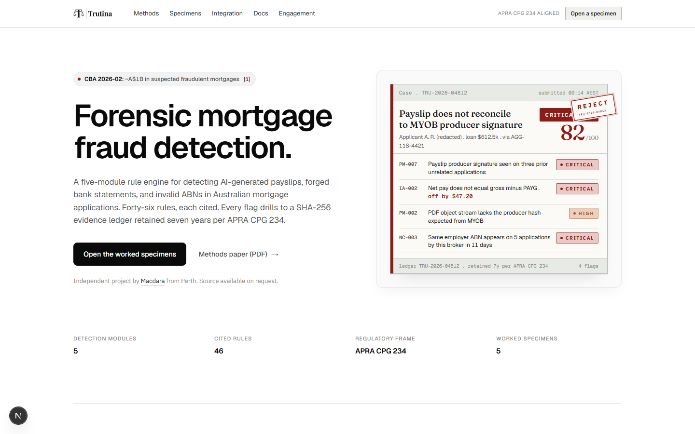
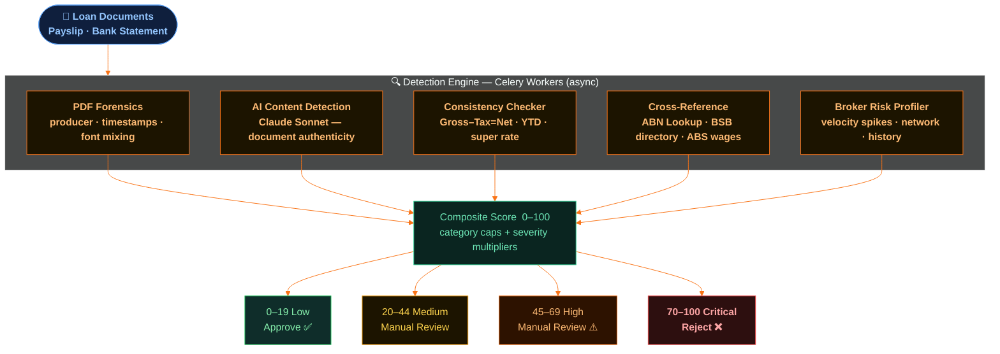

# Trutina

Forensic mortgage fraud detection for Australian lenders. Analyses loan application documents and returns explainable, cited risk scores, catching AI-generated payslips and bank statements before they cost billions.



**Live:** [trutina.com.au](https://trutina.com.au) · independent portfolio project, source available on request

## Why

Commonwealth Bank self-reported ~A$1B in suspected fraudulent mortgage applications (Feb 2026). Fraudsters used AI-generated payslips and bank statements submitted via broker channels — bypassing income verification because banks had no real-time cross-checking against ATO STP or ABN Register data. Westpac and ANZ subsequently flagged similar issues.

Trutina solves this with a five-stage detection pipeline that combines PDF forensics, AI content detection, mathematical consistency checks, cross-referencing against government registries, and broker behavioural profiling.

## Architecture

```
[Vercel] Next.js 16 Frontend
  Landing page, auth gate, case dashboard, risk reports
        |
        v  (HTTPS proxy via Next.js API routes)
[VPS] FastAPI Backend (port 3004)
  /api/v1/cases, /documents, /analyse, /brokers, /webhooks/ingest
        |
   +----+----+--------+
   Celery   Redis   PostgreSQL
   Worker  (queue)  (cases, flags, broker profiles, audit log)
        |
   +----+----+
   Claude    External APIs
   Sonnet    (ABN Lookup, BSB directory, ABS wage data)
```

## Detection Engine

| Module | What it catches | Severity |
|--------|----------------|----------|
| **PDF Forensics** | Non-standard producers, timestamp anomalies, font mixing, text-in-image | Up to HIGH |
| **AI Content Detection** | Claude-powered semantic analysis of document authenticity | Up to CRITICAL |
| **Consistency Checker** | Gross - Tax != Net, super rate off, YTD mismatches, balance errors | Up to CRITICAL |
| **Cross-Reference** | Invalid/cancelled ABNs, employer name mismatches, unknown BSBs, salary outliers | Up to CRITICAL |
| **Broker Risk Profiler** | Submission velocity spikes, high fraud rates, network clustering | Up to HIGH |

Composite scoring with category caps and severity multipliers produces a 0-100 risk score:
- **0-19** Low → Approve
- **20-44** Medium → Manual review
- **45-69** High → Manual review
- **70-100** Critical → Reject

## Detection Pipeline



## Stack

**Frontend:** Next.js 16, TypeScript, Tailwind CSS 4, Recharts, Lucide icons
**Backend:** FastAPI, SQLAlchemy (async), Celery, Redis, PostgreSQL
**AI:** Anthropic Claude Sonnet for semantic document analysis
**External APIs:** ABN Lookup (free), RBA BSB directory, ABS wage benchmarks
**Deployment:** Vercel (frontend) + Docker Compose on VPS (backend)

## Project Structure

```
trutina/
├── frontend/           # Next.js 16 app
│   ├── app/            # App router pages
│   ├── components/     # UI components
│   ├── lib/            # API client, types, auth
│   └── middleware.ts   # Auth gate
├── backend/
│   ├── app/
│   │   ├── api/        # FastAPI route handlers
│   │   ├── analysers/  # 5 detection modules
│   │   ├── core/       # Config, DB, auth
│   │   ├── models/     # SQLAlchemy ORM models
│   │   └── schemas/    # Pydantic request/response schemas
│   ├── db/init.sql     # Database schema
│   └── Dockerfile
└── docker-compose.yml  # PostgreSQL + Redis + backend + worker
```

## API

All endpoints require `X-Api-Key` header except `/health`.

```
POST /api/v1/cases                    # Create a case
POST /api/v1/cases/{id}/documents     # Upload documents (multipart)
POST /api/v1/cases/{id}/analyse       # Trigger async analysis
GET  /api/v1/cases/{id}               # Full detail + flags
GET  /api/v1/cases/{id}/flags         # Fraud flags by category
POST /api/v1/webhooks/ingest          # One-shot: base64 docs in → risk score out
```

## Development

```bash
# Frontend
cd frontend
npm install
npm run dev

# Backend (Docker)
cp .env.example .env
docker compose up -d
```

## License

Proprietary. All rights reserved.
